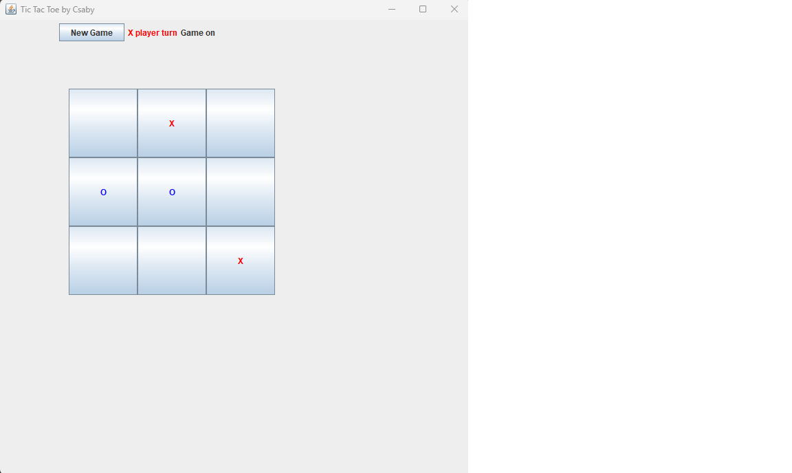

# Tic Tac Toe Game

This is a Java implementation of the popular Tic Tac Toe game. The game provides a graphical user interface where two players can take turns marking X and O on a 3x3 grid. The objective is to get three of your marks in a horizontal, vertical, or diagonal row.

## Features

- Graphical user interface using Swing library
- Player vs. Player mode
- Strategic gameplay with win/lose/draw conditions
- Interactive interface with status updates

## Getting Started

1. Clone the repository:
git clone https://github.com/your-username/tic-tac-toe.git
2. Compile the Java files:
javac Game.java CheckWinner.java
3. Run the game:
java Game
Enjoy playing Tic Tac Toe!

## Screenshots

## Contributing

Contributions are welcome! If you find any issues or have suggestions for improvements, please feel free to open an issue or submit a pull request.

## License

This project is licensed under the MIT License. See the [LICENSE](LICENSE) file for details.
